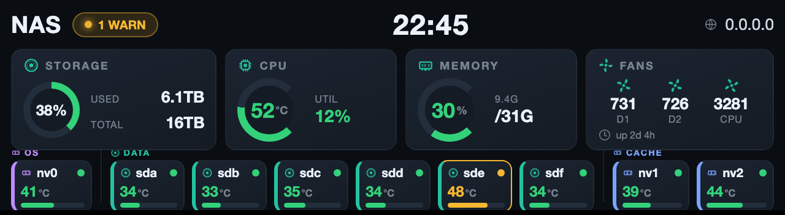
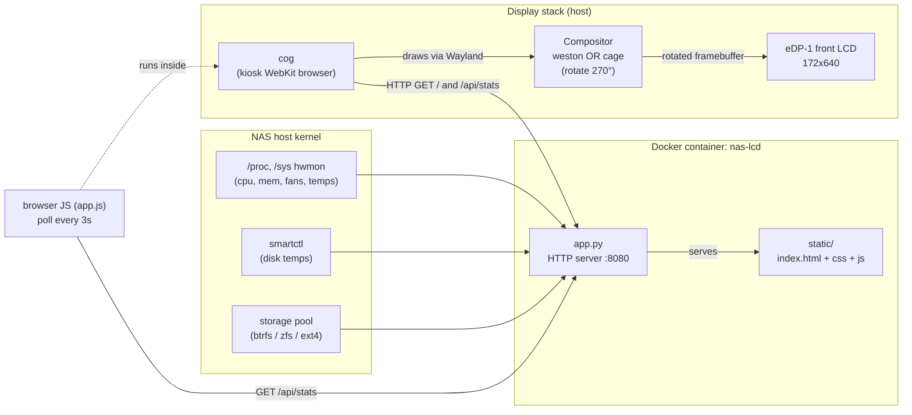
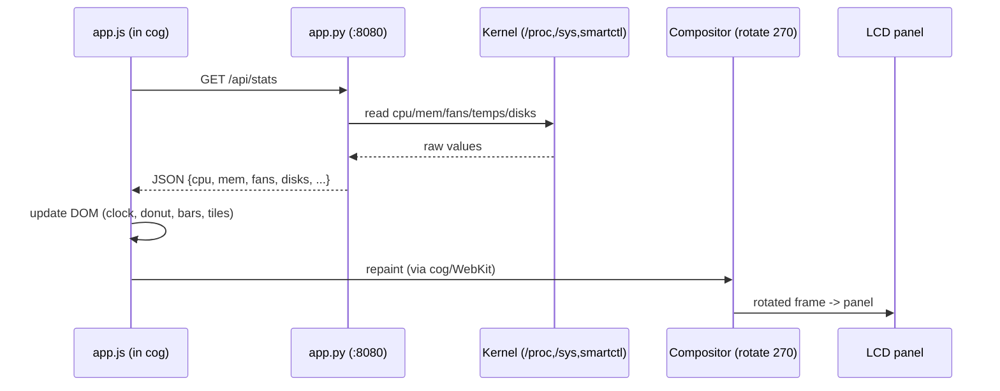

# NAS Front-LCD Custom Dashboard — Documentation

A portable status dashboard for a NAS front LCD (proven on a Zettlab D6 Ultra,
eDP-1 172x640 panel). It renders a custom 640x172 web page onto the panel via a
kiosk browser, with live metrics collected from the host.

Works on **ZettOS today** and on any **Debian/Ubuntu-based** system, including
**FygoOS** (Debian-based, ships Docker + Compose).



*Example render (640×172): OS / DATA / CACHE disk groups with role colours and
SMART-based health state — `sde` shown in amber as a warning example.*

---

## 1. Contents

| File | Role |
|------|------|
| `app.py` | HTTP server: serves the dashboard page + `/api/stats` JSON collector |
| `static/index.html` | 640x172 layout: header, 4 metric cards, disk row |
| `static/style.css` | Dark theme, storage donut, bar gauges |
| `static/app.js` | Polls `/api/stats` every 3s and updates the DOM |
| `Dockerfile` | `python:3.12-slim` + `smartmontools` |
| `docker-compose.yml` | Runs the dashboard with host mounts + caps |
| `nas-lcd-kiosk.service` | systemd unit that launches the kiosk browser |
| `Makefile` | Task shortcuts: `preview`, `render`, `build`, `up`, `deploy`… |
| `docs/preview.js` | Builds an openable browser preview (offline, sample data) |
| `docs/render.js` | Renders the preview PNG via headless Chrome |
| `docs/sample-data.js` | Sample metrics for preview/render (edit to try states) |
| `docs/dashboard-example.png` | The committed preview image (from `make render`) |

---

## 1a. Design preview & tooling

Iterate on the dashboard **without a NAS** using the sample-data preview:

```bash
make preview        # writes docs/preview.html
make preview-open   # …and opens it in your browser
```

`preview.html` loads the real `static/` assets with `docs/sample-data.js`
injected in place of the live `/api/stats`, so you see the exact UI offline.
Edit `docs/sample-data.js` to preview different states (temps, `health`
warn/crit, disk counts/roles), then refresh the browser.

Regenerate the documentation image whenever the UI changes:

```bash
make render         # writes docs/dashboard-example.png (headless Chrome, 2x)
```

Other shortcuts (`make help` lists all):

| Target | Action |
|--------|--------|
| `make build` / `make up` / `make down` | Docker image / run / stop |
| `make logs` / `make stats` | follow logs / fetch live `/api/stats` |
| `make deploy` | copy project to a NAS over SSH (`NAS_HOST`, `NAS_DIR`) |
| `make clean` | remove generated preview artefacts |

> Requires Node.js (for preview/render) and a Chrome/Chromium binary for
> `render` (auto-detected; override with `CHROME_BIN=/path/to/chrome`).

## 2. Architecture



### Data flow (every 3 seconds)



### Why three layers?

They only communicate over HTTP, so each is swappable:

- **Dashboard** (Docker) — portable; identical on every OS.
- **Kiosk browser** (`cog`) — identical binary everywhere.
- **Compositor** — the ONLY OS-specific piece (who owns the panel + rotation).

---

## 3. Panel facts (confirmed from the live device)

| Item | Value |
|------|-------|
| Connector | `eDP-1` on Intel iGPU (Meteor Lake, i915), Lenovo "Go Display" |
| Resolution | 172 x 640 portrait, 32bpp, 60Hz |
| Rotation | `rotate-270` (weston keyword) / `WLR_DRM_TRANSFORM=270` (cage) |
| Framebuffer | `/dev/fb0`, stride 704 (176px padded) — only matters for raw-fb drawing |
| Backlight | `/sys/class/backlight/intel_backlight` (0..192000) |
| Fans | hwmon `zettos_pwm_fan`: fan1/2/3 (rename in app for other boards) |
| CPU temp | hwmon `coretemp`, "Package id 0" |
| Disk temps | `smartctl -A` (ATA raw col 10; NVMe `Temperature:`) |

> On non-Zettlab hardware the hwmon **names** differ (e.g. fans may not be
> `zettos_pwm_fan`). Adjust `_hwmon_by_name(...)` calls in `app.py`.

---

## 4. Setup on a clean Debian / Ubuntu system

### 4.1 Prerequisites

```bash
# Recent kernel recommended (>= 6.8) for Meteor Lake i915.
sudo apt update
sudo apt install -y docker.io docker-compose-plugin cog
```

### 4.2 Free the panel from the text console

The Linux text console owns tty1/`/dev/fb0` by default and will fight the
compositor. Add to the kernel cmdline (e.g. `/etc/default/grub`
`GRUB_CMDLINE_LINUX_DEFAULT`, then `sudo update-grub`):

```
console=tty2 vt.global_cursor_default=0
```

### 4.3 Build & run the dashboard

```bash
cd nas-lcd-dashboard
docker compose up -d
curl -s http://127.0.0.1:8080/api/stats   # sanity check
```

### 4.4 Choose a compositor

**Option A — `cage` (recommended for a clean system).** One command owns the
panel and runs the browser. Rotation via env var. Install the kiosk service:

```ini
# /etc/systemd/system/nas-lcd-kiosk.service
[Unit]
Description=NAS LCD dashboard kiosk (cage + cog on eDP-1)
After=systemd-user-sessions.service docker.service
Wants=docker.service

[Service]
User=kiosk
Group=kiosk
SupplementaryGroups=video render input seat
Environment=XDG_RUNTIME_DIR=/run/user/1000
Environment=WLR_DRM_TRANSFORM=270
ExecStartPre=/bin/sh -c 'for i in $(seq 1 30); do curl -sf http://127.0.0.1:8080/api/stats >/dev/null && exit 0; sleep 1; done; exit 0'
ExecStart=/usr/bin/cage -- /usr/bin/cog http://127.0.0.1:8080
Restart=always
RestartSec=5s

[Install]
WantedBy=multi-user.target
```

```bash
sudo useradd -r -s /usr/sbin/nologin -G video,render,input kiosk 2>/dev/null || true
sudo cp nas-lcd-kiosk.service /etc/systemd/system/
sudo systemctl daemon-reload
sudo systemctl enable --now nas-lcd-kiosk.service
```

If the image is upside down, change `WLR_DRM_TRANSFORM=270` to `90`.

**Option B — reuse an existing `weston`** (as on ZettOS). Point cog at the
already-running compositor instead:

```ini
Environment=WAYLAND_DISPLAY=wayland-1
ExecStart=/usr/bin/cog --platform=wl http://127.0.0.1:8080
```
and set rotation in `weston.ini`:
```ini
[output]
name=eDP-1
transform=rotate-270
```

---

## 5. Running on FygoOS

FygoOS is **Debian-based** and ships **Docker + Docker Compose** (managed from
its web UI's Docker app). That makes it compatible, with caveats similar to
ZettOS (it is an appliance OS, not a plain server).

### What works the same
- **The dashboard container** deploys via FygoOS's Docker/Compose support —
  either import `docker-compose.yml` in the Docker app, or via SSH + CLI.
- `app.py`'s metric sources (`/proc`, `/sys`, `smartctl`) are standard Linux and
  work on FygoOS's Debian base.

### FygoOS-specific checks (do these first over SSH)
FygoOS ships SSH **disabled by default** — enable it in the web UI (Security /
SSH) before you start. Then verify, exactly as we did on ZettOS:

```bash
# 1. Is there a front LCD on the GPU? (may or may not exist on your hardware)
for c in /sys/class/drm/card*/card*-*; do echo -n "$(basename $c): "; cat $c/status; done
ls -l /dev/fb0 2>/dev/null

# 2. What owns the panel? FygoOS may run its OWN compositor/status app.
sudo fuser -v /dev/dri/card0 2>&1 | head
systemctl list-units --type=service --state=running | grep -iE "weston|lcd|display|cage"

# 3. Storage pool path differs: FygoOS uses ext4/btrfs (mdadm) OR ZFS.
#    Find the mount and set POOL_PATH accordingly in docker-compose.yml.
df -hT | grep -vE "tmpfs|overlay"

# 4. hwmon sensor names (fans/temps) will likely differ from Zettlab.
for h in /sys/class/hwmon/hwmon*; do echo "$(basename $h): $(cat $h/name)"; done
```

### Adaptations you will likely need
1. **`POOL_PATH`** in `docker-compose.yml` → point at the FygoOS data pool mount
   (from step 3 above), not `/zettos/pool/1`.
2. **Fan / temp hwmon names** in `app.py` → replace `zettos_pwm_fan` with whatever
   step 4 reports (or drop fans if the board exposes none).
3. **Compositor**:
   - If FygoOS runs its own compositor on the panel, either stop that service
     (like we stopped `zettos-lcd-display`) and use its weston, or
   - If the panel is free / FygoOS is headless on it, install `cage` and use
     Option A above. NOTE: installing apt packages on an appliance OS persists
     and is mildly invasive — fine for testing, cleaner on a plain Debian.
4. **License/appliance caveat**: FygoOS is a paid, hardware-bound appliance.
   Adding services is unsupported by the vendor; keep changes reversible and
   prefer doing this on a plain Debian/Ubuntu install for anything permanent.

### Recommended approach on FygoOS
- **Quick test:** deploy the container via the Docker app, SSH in, install `cog`
  (+ `cage` if the panel is free), and launch the kiosk manually to confirm.
- **Permanent:** if you want it always-on, a plain Debian/Ubuntu install gives
  you full control without fighting the appliance layer. The dashboard is
  identical either way.

### 5.1 FygoOS on the Zettlab D6 Ultra (this exact hardware)

If you install FygoOS **on the same D6 Ultra we characterised**, most values are
already known because they come from the hardware/kernel, not the NAS OS. FygoOS
is Debian with a recent kernel, so the Intel i915 driver enumerates the same
panel and most of the same sensors.

**Already known — carry over unchanged (do NOT re-discover):**

| Setting | Value | Why it is fixed |
|---------|-------|-----------------|
| Panel connector | `eDP-1`, 172x640 | wired to Intel iGPU; OS-independent |
| Rotation | `WLR_DRM_TRANSFORM=270` (cage) / `transform=rotate-270` (weston) | physical mounting |
| Framebuffer | `/dev/fb0`, stride 704 | hardware |
| Backlight | `/sys/class/backlight/intel_backlight` (0..192000) | Intel driver |
| CPU temp | hwmon `coretemp`, "Package id 0" | standard Intel driver |
| Disk temps | `smartctl -A /dev/{sda..sdd,nvme0n1}` | hardware |
| Kernel cmdline | `console=tty2 vt.global_cursor_default=0` | frees the panel |

**Only 3 things to verify/change after installing FygoOS:**

1. **Storage pool path (WILL change).** FygoOS mounts its pool differently than
   ZettOS's `/zettos/pool/1`. Find it and update `POOL_PATH` in
   `docker-compose.yml`:
   ```bash
   df -hT | grep -vE "tmpfs|overlay|udev"   # find the data pool mount
   ```

2. **Fan sensor (LIKELY UNAVAILABLE on FygoOS — confirmed reason).** Verified on
   this D6: fans are exposed by `zettos_pwm_fan`, which is a **custom ZettOS
   platform driver built into the ZettOS kernel** (`platform:zettos_pwm_fan`,
   not a standard I2C hwmon chip, not a loadable module). FygoOS ships its own
   kernel and will almost certainly **not** include this driver, and because the
   fan controller is a board-specific platform device, a generic kernel will not
   auto-detect it under another name either. Check anyway:
   ```bash
   for h in /sys/class/hwmon/hwmon*; do echo "$(basename $h): $(cat $h/name)"; \
     ls $h/fan*_input 2>/dev/null; done
   ```
   - If (unexpectedly) a fan device appears → set `_hwmon_by_name("...")` in
     `app.py` to match.
   - **Most likely: no fan device** → drop the Fans card in `index.html`/`app.js`
     (or leave it showing "--"). CPU/mem/disk/storage all still work fine.
     A fallback is reading fan RPM via `ipmitool`/EC if FygoOS exposes one, but
     that is board-specific and out of scope.

3. **Who owns the front LCD.** FygoOS may run its own panel/status app (like
   ZettOS's `zettos-lcd-display` + weston), or it may not drive this panel at all.
   ```bash
   sudo fuser -v /dev/dri/card0 2>&1 | head
   systemctl list-units --type=service --state=running | grep -iE "weston|lcd|display|cage|cog"
   ```
   - **Panel owned by a FygoOS compositor** → stop that service, then either
     reuse its weston (Option B) or run your own `cage` (Option A).
   - **Panel free** (nothing owns `/dev/dri/card0`) → easier than ZettOS was:
     just install `cage` and use Option A directly.

**Then:** deploy the container (FygoOS Docker app or CLI), `apt install cog`
(+ `cage` if the panel is free), enable `nas-lcd-kiosk.service`. Rotation is
already `270`.

> **Appliance caveat.** FygoOS is a paid, hardware-bound appliance; adding a
> custom service is unsupported and may be disrupted by OS updates. For a
> permanent, fully-controlled setup on this same D6 Ultra, a plain Debian/Ubuntu
> install gives the identical panel result without appliance friction. Choose
> FygoOS if you want its NAS features *and* the dashboard, accepting those limits.

---

## 6. Customising

- **Colours / sizes / layout** → `static/style.css` (it is a normal web page).
- **Add a metric** → extend `collect()` in `app.py`, render it in `app.js`.
- **Disk warn thresholds** → `lvlDisk` / `lvlCpu` in `app.js`.
- **NAS name** → `NAS_NAME` env in `docker-compose.yml`.
- **Refresh rate** → `setInterval(tick, 3000)` in `app.js`.

### 6.1 Disks: auto-discovery, role grouping + SMART health

Disks are auto-discovered from `/sys/block`, classified into **3 roles**, and
rendered as grouped, labelled sections with distinct fixed colour identity.
Display order: **OS → DATA → CACHE** (`order` array in `app.js`).

| Role | Detection | Fixed colour identity |
|------|-----------|-----------------------|
| `os` | matches `OS_NVME` (default `nvme0n1`) | purple edge, NVMe icon, **OS** group (hidden unless `SHOW_OS_DISK=1`) |
| `data` | rotational HDD (`queue/rotational=1`) | teal edge, disk-platter icon, **DATA** group |
| `cache` | non-rotational NVMe/SSD, not the OS drive | blue edge, NVMe icon, **CACHE** group |

**Two independent colour systems (deliberately separated):**
- **Role** = the coloured **left edge + icon + group label** (fixed; never changes).
- **Health** = the **temperature number, health dot, and tile border** (dynamic,
  green/amber/red), driven by **real SMART data** — not just temperature.

**Health assessment (`_parse_smart` in `app.py`), from `smartctl -H -A`:**

| Level | Triggers |
|-------|----------|
| 🔴 crit | SMART overall-health **FAILED**; `Current_Pending_Sector`>0; `Offline_Uncorrectable`>0; NVMe media errors>0; NVMe available-spare ≤ threshold; temp ≥ 60°C. Tile border turns red + pulses. |
| 🟡 warn | `Reallocated_Sector_Ct`>0; `UDMA_CRC_Error_Count`>0; NVMe `Percentage Used` ≥ 80%; temp ≥ 50°C. Amber border. |
| 🟢 ok | none of the above |

The header **status pill** aggregates this: `N OK` normally, `N WARN`, or
`N ALERT` (and turns amber + pulses) if any disk is degraded. This makes the
panel a genuine early-warning display — a failing drive turns amber/red
regardless of temperature.

Relevant env in `docker-compose.yml`:
- `OS_NVME=nvme0n1` — which NVMe is the OS drive.
- `SHOW_OS_DISK=1` — show the OS drive as its own group (set `0` to hide).
- `DISKS=` — optional comma-list override; empty = auto-discover.

> **Role detection note:** "cache" is inferred as *any non-rotational NVMe that
> is not the OS drive*. If a future setup has non-cache data NVMe, refine
> `classify()` in `app.py` (e.g. check bcache membership under
> `/sys/block/<dev>/bcache`).

> **Verified:** failure detection was tested with simulated FAILED/degraded SMART
> output → correctly produced crit/warn; real drives (healthy) → ok. Actual
> visual fit of a full 6+2+1 disk set on the panel was validated at data level
> (API returns correct groups) but only 4 HDDs are physically present to eyeball.

## 7. Troubleshooting

| Symptom | Likely cause / fix |
|---------|--------------------|
| Sideways / upside-down | Wrong rotation → try `90` / `270` (cage) or `rotate-90/270` (weston) |
| Black panel, cog "Loaded" | Another client (OS status app / console) owns the panel — stop it; add `console=tty2` |
| Clock wrong by hours | Container in UTC → set `TZ` + mount `/etc/localtime` (already in compose) |
| Disk temps blank | smartctl needs explicit `-d sat`/`-d nvme` via `/host/dev` (handled in `app.py`) + `SYS_RAWIO` |
| Wrong disk in wrong group | Fix `OS_NVME`, or refine `classify()` in `app.py` |
| Fans show nothing | hwmon name differs — update `_hwmon_by_name("zettos_pwm_fan")` |
| `cage` won't start | user not in `video`/`render`/`seat` groups, or no seat session |
```
