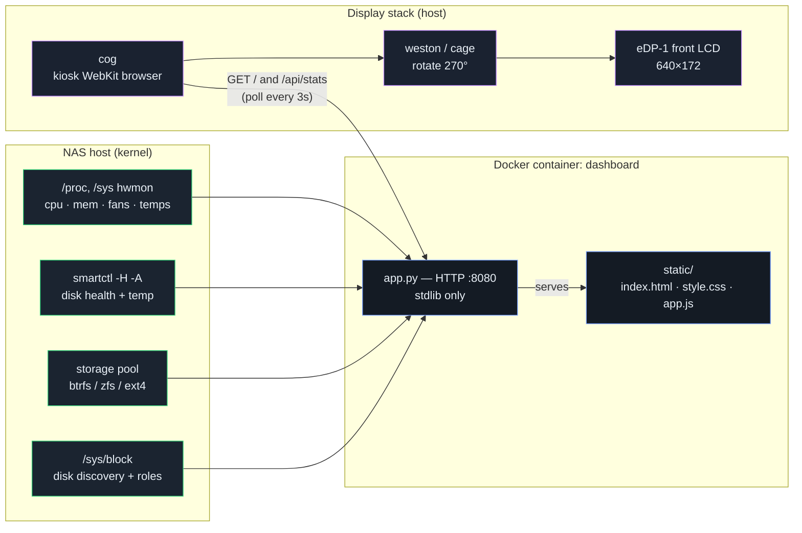

# NAS Front-LCD Dashboard

A custom **640×172 status dashboard** for a NAS front LCD panel. Developed and
proven on a **Zettlab D6 Ultra** (front eDP panel) running stock ZettOS, and
designed to be portable to a plain **Debian/Ubuntu** (or **FygoOS**) install.

It shows hostname/clock/IP, a storage donut, CPU temp + utilisation and memory
as arc gauges, fan RPMs, and a **per-disk row grouped by role** (OS / DATA /
CACHE) with **SMART-based health colouring** — disks turn amber/red on real
drive degradation, not just temperature.

> Proof-of-concept. Works today, but treat it as a hobby project — see caveats.


## How it works

Three decoupled layers that only communicate over HTTP:



**Data cycle (every 3 s):** the browser JS calls `/api/stats` → `app.py` reads
the kernel (`/proc`, `/sys` hwmon, `smartctl`, pool usage) → returns JSON →
the page updates its gauges and grouped disk row → `cog` repaints →
`weston`/`cage` rotates the frame onto the panel.

Only the **compositor** layer is OS-specific. Full architecture (with more
diagrams), setup guides, FygoOS notes, and troubleshooting are in
**[`DOCS.md`](./DOCS.md)**.

## Features

- Zero-dependency Python backend (standard library only) — offline-safe.
- Vanilla HTML/CSS/JS frontend, inline SVG icons — no build step, no CDN.
- Auto-discovers disks and groups them by role (OS / DATA / CACHE).
- Health colouring from **SMART** (overall-health verdict, reallocated/pending
  sectors, CRC errors, NVMe wear/spare/media errors) — with a pulsing alert and
  an aggregate status pill.
- Arc gauges for CPU/memory, storage donut, RPM-driven spinning fan icons.

## Quick start

```bash
# 1. Dashboard (serves 127.0.0.1:8080)
docker compose up -d
curl -s http://127.0.0.1:8080/api/stats | python3 -m json.tool   # sanity check

# 2. Put it on the panel (needs a Wayland compositor + cog)
sudo apt install cog
sudo systemctl enable --now nas-lcd-kiosk.service
```

On a fresh Debian/Ubuntu you provide the compositor yourself (`cage` is easiest);
see [`DOCS.md`](./DOCS.md) §4. Rotation is `270°`
(`WLR_DRM_TRANSFORM=270` for cage, `transform=rotate-270` for weston).

## Configuration

Set via env in [`docker-compose.yml`](./docker-compose.yml):

| Var | Default | Meaning |
|-----|---------|---------|
| `NAS_NAME` | `NAS` | Name shown in the header |
| `OS_NVME` | `nvme0n1` | Which NVMe is the OS drive |
| `SHOW_OS_DISK` | `1` | Show the OS drive as its own group |
| `DISKS` | *(empty)* | Comma-list override; empty = auto-discover |
| `POOL_PATH` | `/host/pool` | Storage pool mount to report usage for |
| `TZ` | *(host)* | Timezone for the clock |

## Repository layout

| Path | Purpose |
|------|---------|
| `app.py` | HTTP server: page + `/api/stats`; metric collectors |
| `static/` | `index.html`, `style.css`, `app.js` (the 640×172 UI) |
| `Dockerfile` / `docker-compose.yml` | container build + run config |
| `nas-lcd-kiosk.service` | systemd unit for the `cog` kiosk |
| `DOCS.md` | full documentation |
| `AGENTS.md`, `CLAUDE.md`, `.kiro/` | AI-agent context files |

## Caveats

- Hardware-specific bits: the fan sensor (`zettos_pwm_fan`) is a custom ZettOS
  in-kernel driver and won't exist on other OSes (the fan card degrades to
  "n/a"); the pool path differs per OS. See [`DOCS.md`](./DOCS.md) §5–6.
- No automated tests yet. SMART failure colouring was verified with simulated
  bad-SMART data; it has not been exercised against a genuinely failing drive.
- Docker on ZettOS runs the `vfs` storage driver (its root is an overlay mount).

## Contributing

Small project, PRs/issues welcome. AI agents: read [`AGENTS.md`](./AGENTS.md)
first — it documents the hard constraints (zero-dep backend, no frontend build,
640×172 target, role-vs-health colour split).

## License

MIT — see [`LICENSE`](./LICENSE).
